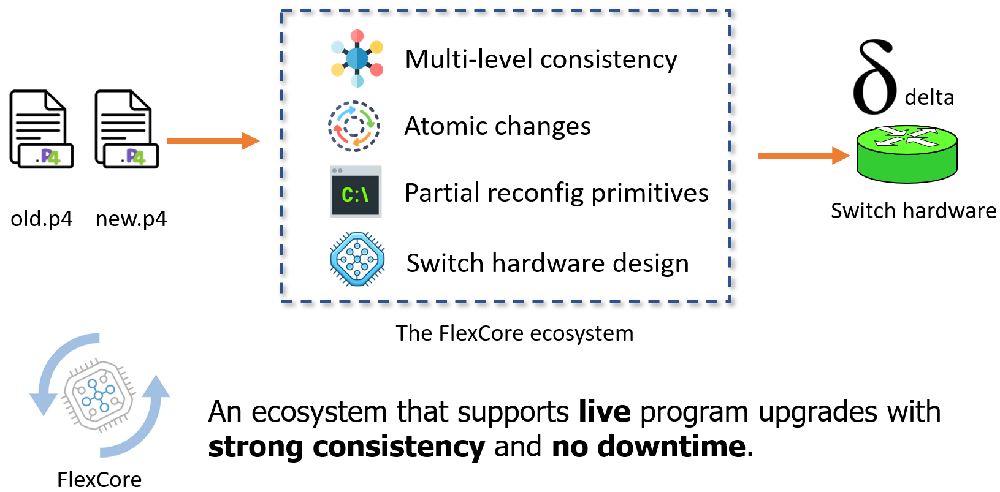

## FlexCore

Today's programmable switches are only programmable at compile time. Once the program is deployed, the switch becomes "fixed". To change the switch function, we must recompile and flash the switch pipeline, which create a lot of distruption.
FlexCore is an ecosystem for runtime programmability. It supports live program upgrades on switches with strong consistency and no downtime.

<p align="center">
  
</p>

The ecosystem of FlexCore includes:
- A switch hardware design for live program upgrades
- Partial reconfiguration primitives to change P4 elements at runtime
- A version control mechanism to achieve transactional changes
- Multi-step transaction consistency algorithms.

More details can be found here:
[FlexCore (NSDI'22)](https://jxing.me/pdf/flexcore-nsdi22.pdf).


This repo serves as a tutorial of the system. It provides setup for the BMv2-based implementation and examples for test.


## Setup

FlexCore includes two parts: 1) the software to process inputs and computes the reconfiguration plans with different consistency guarantees; and 2) the software switch implemented based on BMv2.

The first part is included in this repo, which just requires the regular Python3 environment. The second part is separately maintained in another repo, [runtime-bmv2](https://github.com/alex1230608/runtime-bmv2). Please follow the instructions in the runtime-bmv2 repo to setup the software switches.


## Input

FlexCore supports three types of inputs. The first one can be accepted to deployed into the software switch, while the other two are mainly used to test the software algorithms.

### P4 Json files as inputs
Provides two json files compiled by `p4c` to the system: one is from the old P4 program; the other is from the new P4 program. FlexCore will transform them input an IR and computes the differences. According to the specified consistency level, these differences will be transformed to reconfiguration pritimives, which can be inputs for the software switch.

The parameters are shown as the following:
```
$ python3 main.py -h
usage: main.py [-h] -p {exec,elem,prog} -b {graph,json,obj} -old OLD_PATH -new
               NEW_PATH -out OUT_PATH

optional arguments:
  -h, --help           show this help message and exit
  -p {exec,elem,prog}  The choice of planner
  -b {graph,json,obj}  The choice of input builder
  -old OLD_PATH        The path of the old json/graph/obj
  -new NEW_PATH        The path of the new json/graph/obj
  -out OUT_PATH        The path to save generated commands
```

Example input:
```
python3 main.py -p prog -b json -old ../examples/firewall/firewall_old.json -new ../examples/firewall/firewall_new.json -out ./
```

### Plaintext graph files as inputs
This is used to test the software algorithm. Inputs are manully written graphs.

Example input:
```
python3 main.py -p prog -b graph -old ../examples/test1/test1_old.txt -new ../examples/test1/test1_new.txt -out ./
```


### Synthetic graph objects as inputs
This is used to test the software algorithm. Inputs are sythetic IR graphs.

#TODO @Kuo-Feng, write the instruction to use the synthesizer


Example input:
```
python3 main.py -p prog -b obj -old ../examples/test1/test1_old.graph -new ../examples/test1/test1_new.graph -out ./
```

## Deploy into the software switch

@Kuo-Feng, add instructions or pointers to the usage of runtime bmv2.

## Citing
If you feel our paper and code is helpful, please consider citing our paper by:
```
@inproceedings {flexcore-xing,
    author = {Jiarong Xing and Kuo-Feng Hsu and Matty Kadosh and Alan Lo and Yonatan Piasetzky and Arvind Krishnamurthy},
    title = {Runtime Programmable Switches},
    booktitle = {19th USENIX Symposium on Networked Systems Design and Implementation (NSDI 22)},
    year = {2022}
}
```

## Contact
If you have any questions about of paper and the code, please contact us:
```
Jiarong Xing (jxing@rice.edu)
Kuo-Feng Hsu (alex1230608@gmail.com)
```

## License
The code is released under the [GNU Affero General Public License v3](https://www.gnu.org/licenses/agpl-3.0.html).
